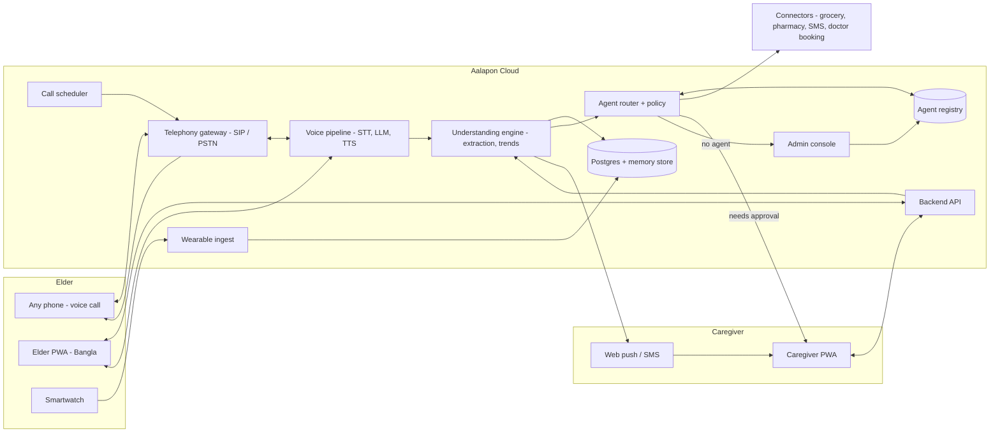

# Aalapon (আলাপন) - Project Memory

> This file is the persistent memory for the Aalapon project. Any person or LLM picking up this project must read this file fully before doing anything else, and must update the "Current status" and "Session log" sections before ending a session.

---

## 1. Rules (must always be followed, no exceptions)

1. **Git identity.** Never use Claude, srotdev, Codex, Copilot, or any AI tool or other person as author, committer, contributor, or co-author when committing or pushing to the GitHub repo. Always commit as `ahammadshawki8` (`ahammadshawki8 <ahammadshawki8@users.noreply.github.com>`). Do not add `Co-Authored-By` trailers or "Generated with" lines to commits or pull requests.
2. **No em dashes, no emojis.** Never use the long em dash character (or the en dash) and never use emojis anywhere in the project: docs, code, comments, UI strings, commit messages. Use a plain hyphen `-`, a colon, or rewrite the sentence. Use icons (lucide-react) instead of emojis in the UI.
3. **Mobile first.** Every screen is designed and verified at 360px to 430px width first. Desktop is secondary. Minimum tap target 44x44px (elder screens: 56px or larger). No horizontal scroll at any width.
4. **Bangla first for elders.** Every elder-facing string is in Bangla. Caregiver screens are in English with Bangla quotes where the elder speaks. Never ship lorem ipsum; use realistic Bangla content.
5. **Responsible AI language.** Aalapon is a companion and decision-support tool. Never describe it as diagnosing, prescribing, or replacing a doctor. Use words like "wellbeing update", "consider checking in", "referral". (Competition rule Q13 for the Healthcare category.)
6. **Consent is visible.** Any feature that uses video, watch data, or recordings must show a consent state in the UI.
7. **Keep this file current.** After any meaningful change, update section 13 (Current status) and section 14 (Session log). Keep the working folder at `C:\Users\Shawki\Desktop\gp\Aalapon`, remote `github.com/ahammadshawki8/Aalapon`.
8. **Do not commit secrets.** API keys go in `.env` (git-ignored). Provide `.env.example` with empty values.

---

## 2. Identity

| Field | Value |
|---|---|
| Name | **Aalapon** (Bangla: আলাপন, meaning "conversation") |
| Tagline | Every conversation is a chance to care. |
| Bangla tagline | প্রতিটি আলাপই যত্নের সুযোগ। |
| One-liner (13 words max) | An AI companion that calls elderly parents daily and turns conversations into help. |
| Competition | Grameenphone FutureMakers 2026, theme "AI for Social Good" |
| Category | Healthcare & Mental Wellbeing |
| Round 1 deadline | 30 September 2026 (form + video of 2 minutes or less, MP4) |
| Product form | Progressive Web App (installable, works in browser) + voice call channel that works on any phone, including button phones |
| Owner / GitHub | ahammadshawki8 |

---

## 3. The problem

**Plain version:** Elderly parents in Bangladesh increasingly live alone or with little daily company, because children work in Dhaka, other cities, or abroad. When a child calls, the parent says "আমি ভালো আছি" (I'm fine) so as not to be a burden. Small signals (poor sleep, skipped medicine, not eating, low mood, a need for groceries) go unnoticed until they become a crisis.

**Who experiences it:**
- The elder (60+), often a widowed mother, often with a basic button phone, low digital literacy, Bangla speaker.
- The caregiver: adult children and grandchildren who want peace of mind but cannot be physically present and cannot call long enough, often enough, to notice patterns.

**Why existing approaches are insufficient:**
- Phone calls from family are irregular and short, and the elder hides problems.
- Health and eldercare apps assume a smartphone, English literacy, and that the elder will open an app by themselves.
- Paid caregivers and old-age homes are expensive, scarce, and culturally uncomfortable for many families.
- Smartwatches collect vitals, but nobody turns the numbers into a human conversation or an action.

**Counter-intuitive insight (use in the pitch):** The elder does not lack a phone; they lack someone who calls, listens, and remembers. The problem is not access to technology, it is the absence of a consistent listener who notices patterns and acts on them.

**Consumer insight (proposed, to validate with interviews):** Parents want companionship without feeling like a burden. Children want peace of mind but cannot always be there.

---

## 4. The solution

Aalapon is an AI companion that:
1. **Calls** the elder on a schedule (for example every morning at 9:00) over a normal voice call. Works on any phone, including button phones, because it is a standard phone call. Smartphone users can also take the call as an in-app voice or video call.
2. **Talks naturally in Bangla**, remembers past conversations, asks follow-up questions ("মা, সকালের ওষুধটা খেয়েছেন?", "রাতে ঘুম কেমন হয়েছে?").
3. **Understands**: extracts needs (food, medicine refill, doctor, a call from a child), medicine adherence, mood, sleep, pain mentions, and routine changes.
4. **Uses smartwatch data** (optional): heart rate, SpO2, sleep duration, steps, resting BPM trends. The AI brings these into the conversation ("ঘড়ি বলছে কাল রাতে ঘুম কম হয়েছে, শরীর ঠিক আছে তো?") and into caregiver alerts.
5. **Acts** through agents: some tasks run automatically (order groceries from a set list, set a reminder, notify family), some need a caregiver's approval (book a doctor, spend above a limit), and when no agent exists for a new type of request, the system asks the admin to approve creating one.
6. **Reports** to caregivers with short, actionable wellbeing updates: "Your mother mentioned poor sleep three times this week. Consider checking in."

### Two portals

| Portal | User | Language | Core jobs |
|---|---|---|---|
| Elder portal (বয়োজ্যেষ্ঠ) | The elderly parent | Bangla, large text, big buttons, voice-first | Receive/start AI call, tap a need ("ওষুধ লাগবে", "খাবার লাগবে", "ডাক্তার", "ছেলেকে ডাকো"), see today's medicine, see watch summary |
| Caregiver portal | Children / grandchildren | English (Bangla quotes shown) | Wellbeing dashboard, insights, call summaries and transcripts, requests and approvals, agents, medicine and call schedule, watch vitals, alerts |
| Admin (later tier) | Aalapon operations | English | Approve new-agent requests, monitor safety, manage connectors |

### Two ways for elders to share needs
1. **Through the call** (primary, works on button phones): they just say it.
2. **Through the elder portal** (smartphone): tap a big need tile or press and speak.

---

## 5. Feature list

### Elder portal
- Home: greeting by time of day, next scheduled call, big "Call Aalapon now" button.
- Need tiles: medicine, food/groceries, doctor, call my child, I feel unwell (priority).
- Today's medicines with "খেয়েছি" (taken) confirmation.
- Incoming AI call screen (voice orb, live Bangla captions, large accept/decline).
- Smartwatch summary card (heart rate, SpO2, sleep, steps) in simple words.
- Request status ("আপনার অনুরোধ পাঠানো হয়েছে", "তানভীর অনুমোদন দিয়েছে").

### Caregiver portal
- Dashboard: parent status card, wellbeing score, last call, mood trend, watch vitals, top insight.
- Insights feed: pattern-based updates (sleep, medicine adherence, mood, appetite, pain mentions, vitals trends).
- Call history: summary per call, full transcript (Bangla with English translation), flagged moments.
- Requests inbox: needs raised by the elder, agent actions taken, approvals waiting.
- Agents: list of active agents with autonomy level (auto / needs approval), pending new-agent requests.
- Schedule: call times, medicine list and times, follow-up questions.
- Devices: smartwatch connection and consent.
- Alerts: urgent notification (for example "felt unwell" or SpO2 below threshold) with one-tap call.

### Voice call channel
- Scheduled outbound calls, retry if unanswered, elder can call back a fixed number.
- Bangla speech recognition and natural Bangla voice.
- Memory of previous calls and of the family context.
- Follow-up questions from the caregiver's schedule (medicine, meals, sleep, pain).

### Smartwatch integration
- Metrics: heart rate, resting heart rate, SpO2, sleep duration and quality, steps, activity, fall detection where the watch supports it.
- Sources (see tier 5): Android Health Connect (via a thin Android wrapper / TWA companion), Fitbit Web API, Garmin Health API, Withings API, Web Bluetooth standard Heart Rate profile for live readings on Chrome Android. Apple HealthKit needs a native iOS companion (later).
- Use: trend detection (for example sleep under 5 hours for 3 nights), gentle conversational follow-up, caregiver alerts with thresholds set by the family and clearly labelled "not a diagnosis".

### Agent system
- Agent = a vetted, configurable action (connector + policy), not arbitrary generated code.
- Autonomy levels: `auto` (runs immediately), `approve` (caregiver taps approve), `blocked`.
- Flow: request -> intent + slots extracted -> match agent in registry -> policy check -> execute or ask approval -> confirm back to elder on next call.
- No match -> "new agent request" with the example conversation -> admin reviews -> admin builds the agent from connectors and templates -> available for everyone.
- Initial agents: Family Contact (call/SMS a child), Grocery Order, Medicine Refill (partner pharmacy), Reminder, Doctor Appointment (approval), Emergency Escalation.

---

## 6. Why this fits FutureMakers 2026

Mapped to the seven Round 1 criteria:

| Criterion | How Aalapon scores |
|---|---|
| Originality and Creativity | Voice-first AI companion over a normal phone call (works on button phones), not another app the elder must open. Conversation + watch data + agents that act. |
| Problem Relevance | A growing elderly population, nuclear families, migration of children to cities and abroad, high loneliness and depression prevalence among Bangladeshi elders (sources in section 7). |
| AI and Technology Integration | Bangla speech recognition, conversational LLM with memory, information extraction, longitudinal pattern detection across calls and vitals, tool-using agents. Without AI, a daily personal call to millions of elders does not scale. |
| Impact Potential | 1,000 users x 1 daily call x 30 days = 30,000 check-ins per month, each a chance to notice a need. Measurable: medicine adherence, time-to-response on needs, caregiver check-in frequency. |
| Feasibility and Clarity | Built from available services (telephony, Bangla STT/TTS, LLM APIs, wearable APIs). PWA means no app-store dependency. Payer: the caregiver (subscription), not the elder. Natural telecom partner: Grameenphone (voice minutes, billing). |
| Video-Pitch Quality | Emotional opening ("I'm fine") + one presenter + app overlays, per script. |
| Responsible and Ethical AI | Consent per data type, caregiver approval for sensitive actions, admin approval for new agents, no diagnosis claims, escalation to humans, transparent summaries with the exact quote that triggered an insight. |

**Responsible AI one-liners (reuse in the form and video):**
- Accuracy and safety: insights are shown with the exact quotes or readings that caused them; vitals alerts use conservative thresholds and always say "not a diagnosis, consider checking in".
- Human oversight: spending money, booking doctors, and any new agent need a human approval.
- Privacy: video and watch data are opt-in per type, can be switched off any time, and are summarised rather than stored raw where possible.
- Accessibility and inclusion: works on any phone through a normal call, Bangla voice, no reading needed.
- Misuse: agents come only from a vetted registry; the LLM cannot invent new actions on its own.

---

## 7. Sources and evidence

Verify each number against the primary source before quoting it in the submission.

| Claim | Source |
|---|---|
| About 1 in 4 older adults experience social isolation; WHO 2025 resolution on social connection | WHO, "Social connection linked to improved health and reduced risk of early death" (30 Jun 2025): https://www.who.int/news/item/30-06-2025-social-connection-linked-to-improved-heath-and-reduced-risk-of-early-death |
| Social isolation and loneliness overview for older people | WHO: https://www.who.int/teams/social-determinants-of-health/demographic-change-and-healthy-ageing/social-isolation-and-loneliness |
| Mental health of older adults | WHO fact sheet: https://www.who.int/news-room/fact-sheets/detail/mental-health-of-older-adults |
| Bangladesh population 2025 about 175.7 million; 65+ share about 7%, giving about 12.3 million aged 65+ (script figure, verify the % on the dashboard) | UNFPA World Population Dashboard, Bangladesh: https://www.unfpa.org/data/world-population/BD |
| 60+ was 9.3% of population in 2022 (about 15.8 million); projected 36 million (22%) by 2050 | Reported from UNFPA in The Daily Star: https://www.thedailystar.net/business/economy/news/ageing-bangladesh-are-we-ready-more-social-spending-3574911 |
| 65+ share in Bangladesh over time | World Bank: https://data.worldbank.org/indicator/SP.POP.65UP.TO.ZS?locations=BD |
| Depression, anxiety, insomnia, loneliness prevalence among Bangladeshi elders (depression about 58%, insomnia about 77%) | PubMed 41254547: https://pubmed.ncbi.nlm.nih.gov/41254547/ |
| Living alone roughly doubles the odds of loneliness (AOR 2.17) among Bangladeshi older adults | PMC: https://pmc.ncbi.nlm.nih.gov/articles/PMC9635750/ |
| Loneliness among Bangladeshi older adults (about 62% in one study) | ResearchGate: https://researchgate.net/publication/335918296_Prevalence_and_Determinants_of_Loneliness_among_Older_Adults_in_Bangladesh |
| Depression, anxiety and stress among elderly in Bangladesh; communication with children as a factor | PMC: https://pmc.ncbi.nlm.nih.gov/articles/PMC13004408/ |
| Nuclear families rising, elders left alone | Prothom Alo opinion: https://en.prothomalo.com/opinion/qsbg1glnnj |
| Everyday challenges of ageing in Bangladesh | Springer: https://link.springer.com/rwe/10.1007/978-981-99-7842-7_170 |

Competition context lives in `../GP-FUTUREMAKERS-2026-MASTER-BRIEF.md` (not committed to this repo).

---

## 8. Architecture

### 8.1 High level



### 8.2 One call, step by step

```
Scheduler (09:00) -> Telephony dials elder's number
Elder answers -> audio stream -> Bangla STT -> LLM (persona + memory + today's follow-ups + watch summary)
LLM reply -> Bangla TTS -> elder hears it
During/after call -> transcript -> extraction (needs, meds taken, mood, sleep, pain) -> DB
Extraction -> trend check across calls + vitals -> insight? -> caregiver notification
Need found -> agent router -> auto / approval / new-agent request
Next call -> AI closes the loop ("মা, আপনার ওষুধ আজ বিকেলে পৌঁছে যাবে")
```

### 8.3 Proposed stack

| Layer | Choice (initial) | Notes |
|---|---|---|
| Frontend | React 19 + TypeScript + Vite + Tailwind CSS v4 + vite-plugin-pwa + react-router (HashRouter) + lucide-react | Current repo. Fonts: Anek Bangla (Bangla), Onest (Latin) |
| Backend | FastAPI (Python) or Node (Hono) | Pick in tier 1; Python favoured for the voice/AI pipeline |
| Database | Postgres (Supabase: auth with phone OTP, storage, realtime) | Row-level security per family |
| Telephony | Twilio / SIP trunk; long term a Bangladeshi operator partnership (Grameenphone) for local numbers and cheaper minutes | Normal voice call = button phone support |
| Voice orchestration | Pipecat or LiveKit Agents | Handles streaming, barge-in, turn-taking |
| Bangla STT | Google Cloud Speech-to-Text (bn-BD), Whisper-family models, evaluate local Bangla ASR | Benchmark on elderly speech and dialects |
| Bangla TTS | Azure Neural TTS bn-BD voices, Google Cloud TTS bn | Warm, slow speaking rate for elders |
| LLM | Claude (claude-sonnet-5-5 for calls, claude-haiku-4-5 for cheap extraction) with tool use | Structured JSON extraction |
| Wearables | Health Connect (Android companion/TWA), Fitbit, Garmin, Withings APIs, Web Bluetooth HR profile | Opt-in per metric |
| Notifications | Web Push (PWA), SMS fallback | |
| Hosting | Vercel/Netlify for PWA, container host for backend | |

### 8.4 Core data model (draft)

- `family` (id, name, plan)
- `elder` (id, family_id, name, phone, language, dialect, call_times, consent flags)
- `caregiver` (id, family_id, name, phone, relation, role)
- `call` (id, elder_id, started_at, duration, channel, status, summary, transcript_ref)
- `observation` (id, elder_id, call_id?, type: need|medicine|mood|sleep|pain|vital, value, quote, confidence, at)
- `insight` (id, elder_id, kind, text, evidence_ids, severity, status)
- `request` (id, elder_id, source: call|portal, intent, slots, status, agent_id?)
- `agent` (id, name, connector, autonomy, policy, enabled)
- `agent_request` (id, example_request_id, proposed_by, status, admin_notes)
- `vital_reading` (id, elder_id, metric, value, unit, at, source)
- `medicine` (id, elder_id, name, dose, times)

---

## 9. Frontend (tier 0) specification

### 9.1 Design direction (v2, 2026-09-30)
- References: `../ui_inspired/1.jpg`, `2.jpg`, `3.jpg` (sage + orange, pastel tiles, pill buttons, rounded bottom nav).
- UX rules followed: nextlevelbuilder/ui-ux-pro-max-skill and awesome-skills/mobile-app-design (44-48px tap targets, 16px+ body, labelled bottom nav with 5 tabs max, grouped lists instead of piles of cards, tabular numbers, no emoji icons, reduced-motion support, no horizontal scroll).
- Brand mark (`Mark` in `src/components/brand.tsx`): two speech bubbles leaning into each other, cream/moss and marigold, the overlap forms a leaf-shaped lens. Meaning: two voices, one conversation; the moment listening turns into care. Wordmark: "আলাপন" in Anek Bangla bold + lowercase "aalapon".
- Ma's portrait (`MaAvatar`): hand-drawn SVG, grey hair, green sari over the head with a marigold stitched border, round glasses. Used on the elder home, caregiver hero card, quotes and transcripts.
- Palette (tokens in `src/index.css`): paper `#F3F4EE`, card `#FFFFFF`, ink `#16221B`, moss `#1D3A2E` (primary), marigold `#F4A340` (call/CTA), thread red `#CF523C` (alerts only), sage `#A7C095`, pastel tiles lilac `#EBE5F9`, mint `#DFF0E4`, peach `#FDE7D4`, sky `#E0ECF8`.
- Type: Onest for Latin, Anek Bangla for Bangla (utility class `bn`). Caregiver scale 12/13/15/17/28, elder scale 15/17/19/24.
- Signature moments: the voice orb on the call screen (brand mark breathing with a live waveform) and the dark moss hero card on the caregiver home (score + 7-day sparkline + Call / Last call / Voice note).
- Landing page (v3): a live "hero stage" instead of empty space. the Aalapon voice orb (brand mark + live waveform, badge "মায়ের সাথে কথা চলছে") in the centre with rotating stitched rings; headline and subtitle centred, no দাঁড়ি in the headline, and floating cards that pop in one by one: the AI's Bangla question, Ma's reply, the watch sleep reading, the agent's completed order, and the notification Tanvir gets. Below it: headline, three capability chips (any phone, speaks Bangla, family in loop), and two role buttons.
- Caregiver home is organised as "Ma's day": hero, wellbeing update, one approval, 2x2 watch tiles with sparklines, today timeline.

### 9.2 Routes
| Route | Screen |
|---|---|
| `/` | Welcome + role picker (Elder / Caregiver) |
| `/elder` | Elder home |
| `/elder/call` | AI call screen (incoming -> live with captions -> ended) |
| `/elder/need/:type` | Need confirmation |
| `/care` | Caregiver dashboard |
| `/care/insights` | Insights feed |
| `/care/calls` and `/care/calls/:id` | Call history and transcript |
| `/care/requests` | Requests, approvals, agent actions |
| `/care/agents` | Agent registry and new-agent requests |
| `/care/health` | Watch vitals |
| `/care/settings` | Schedule, medicines, devices, consent |

Mock data lives in `src/data/`. Shared state (requests raised by the elder show up in the caregiver inbox) uses React context persisted to localStorage, so the video demo can show the full loop on two phones or two tabs.

### 9.3 Demo persona
- Elder: রহিমা খাতুন (Rahima Khatun), 72, lives alone in Mymensingh, button phone + a basic smartwatch gifted by her son.
- Caregiver: Tanvir Ahmed (son), software engineer in Dhaka. Granddaughter Nabila as second caregiver.

---

## 10. Implementation tiers

### Tier 0 - Demo frontend (target: 30 Sep 2026, for the video)
- [x] Scaffold Vite + React + TS + Tailwind v4 + PWA manifest + service worker
- [x] Design tokens, fonts, mobile shell
- [x] Welcome / role picker
- [x] Elder: home, need tiles, medicine confirm, watch card, AI call screen with scripted Bangla conversation
- [x] Caregiver: dashboard, insights, calls + transcript, requests + approvals, agents, health vitals, settings
- [x] Elder request -> caregiver inbox loop (localStorage, syncs across tabs)
- [x] Verified at 390px in Playwright, build passes, PWA icons generated
- [ ] Deploy (Vercel or GitHub Pages) for recording
- [ ] Real device check (Android Chrome install, iOS Safari add to home screen)

### Tier 1 - Backend foundation
- Auth (phone OTP), family / elder / caregiver model, REST API, replace mock data, web push.

### Tier 2 - Voice call pipeline
- Outbound scheduled calls through telephony, Bangla STT/TTS, LLM persona with memory, transcripts, retries, in-app call for smartphone users.
- Benchmark Bangla ASR on elderly voices and regional dialects; pick provider.

### Tier 3 - Understanding and insights
- Structured extraction per call, trend rules plus LLM summarisation, insight evidence (quotes), caregiver notifications, weekly digest.

### Tier 4 - Agent system
- Agent registry, router, policy engine (auto / approve), connectors (SMS/call family, grocery, pharmacy, reminders), approval flow in caregiver portal, admin console for new-agent requests, audit log.

### Tier 5 - Smartwatch and video signals
- Health Connect companion (Android TWA wrapper), Fitbit/Garmin/Withings OAuth connectors, Web Bluetooth live HR, threshold alerts, watch data in call context.
- Optional video call mode with consent: coarse signals only (for example looks tired, did not appear), never diagnosis.

### Tier 6 - Pilot and scale
- Pilot with 20-50 families (interviews first), measure: call answer rate, medicine adherence self-report, time from need to action, caregiver satisfaction.
- Partnerships: telecom (Grameenphone), pharmacy and grocery delivery, eldercare NGOs.
- Pricing hypothesis: caregiver subscription, per-family monthly fee; validate willingness to pay.

---

## 11. Impact model (targets, not measured outcomes)

- 1,000 users x 1 completed daily call x 30 days = **30,000 check-ins per month**.
- Each check-in = one chance to notice a need (medicine, food, health, loneliness).
- Metrics to measure in pilot: medicine adherence, number of needs resolved, median time need -> action, caregiver check-in frequency after insights, elder self-reported loneliness (short validated scale) before vs after 8 weeks.

---

## 12. Repo layout

```
Aalapon/
  project.md          <- this file
  index.html
  vite.config.ts      <- Tailwind + PWA config
  public/             <- icons, manifest assets
  src/
    main.tsx, App.tsx, index.css
    components/ui.tsx <- Screen, BackBar, PageTitle, SectionHead, Card, VoiceOrb, CareNav, Spark, Bars, Pill
    components/brand.tsx <- Mark (logo), Logo (mark + wordmark), MaAvatar, Initials
    pages/elder/      <- elder portal screens
    pages/care/       <- caregiver portal screens
    data/mock.ts      <- all demo content (persona, medicines, vitals, insights, calls, agents, call script)
    state/AppState.tsx <- requests + medicines taken, persisted to localStorage
```

Commands: `npm install`, `npm run dev`, `npm run build`, `npm run preview`.

---

## 13. Current status

- 2026-09-30: Tier 0 demo frontend built and pushed. All routes in section 9.2 work with mock data. Not yet deployed.
- Demo tips for the video: open `#/elder/call?mode=incoming` for the incoming AI call (tap the caption to skip to the next line). Finishing the call adds a grocery order and a medicine refill approval to the caregiver's Requests. "Reset demo data" is at the bottom of the Requests screen.
- 2026-09-30 (v2): UI redesign pass: new brand mark and app icons, hand-drawn avatar, compact grouped layouts, labelled bottom nav, sparklines, timeline, accordion insights. Duplicate requests are deduped by title.
- 2026-09-30 (v3): Landing page rebuilt as an animated hero stage that shows the whole product loop in one screen.
- Next: deploy, real-device check, then Tier 1.

## 14. Session log

- 2026-09-30: UI v2 redesign pushed.
- 2026-09-30: Idea locked (Aalapon). Wrote project.md, added smartwatch integration to scope, scaffolded frontend, created GitHub repo ahammadshawki8/Aalapon.
